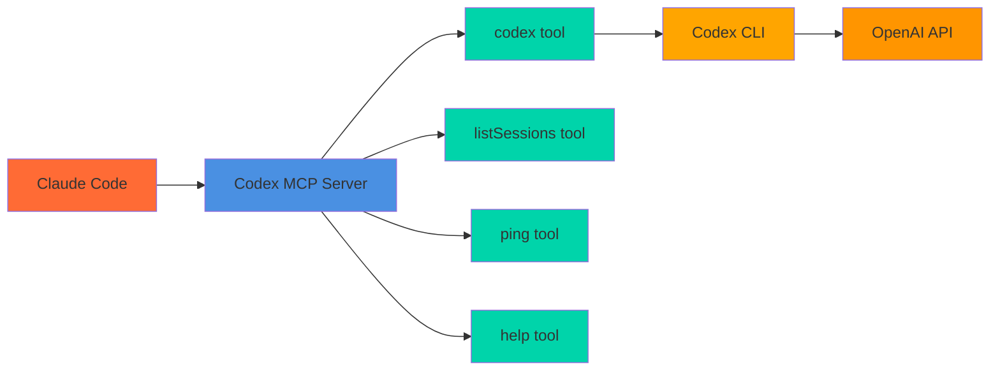

# Codex MCP Server

MCP server wrapper for OpenAI Codex CLI that enables Claude Code to leverage Codex's AI capabilities directly.



## Prerequisites

- **OpenAI Codex CLI** must be pre-installed and configured
  - Install: `npm i -g @openai/codex` or `brew install codex`
  - Setup: Run `codex login` or set `OPENAI_API_KEY` environment variable
- **Claude Code** installed

## Installation

### One-Click Installation

#### VS Code

[](https://vscode.dev/redirect/mcp/install?name=codex-cli&config=%7B%22type%22%3A%22stdio%22%2C%22command%22%3A%22npx%22%2C%22args%22%3A%5B%22-y%22%2C%22%40comfucios%2Fcodex-mcp-server%22%5D%7D)

#### VS Code Insiders

[](https://insiders.vscode.dev/redirect/mcp/install?name=codex-cli&config=%7B%22type%22%3A%22stdio%22%2C%22command%22%3A%22npx%22%2C%22args%22%3A%5B%22-y%22%2C%22%40comfucios%2Fcodex-mcp-server%22%5D%7D)

#### Cursor

[](https://cursor.com/en/install-mcp?name=codex&config=eyJ0eXBlIjoic3RkaW8iLCJjb21tYW5kIjoibnB4IC15IEBjb21mdWNpb3MvY29kZXgtbWNwLXNlcnZlciIsImVudiI6e319)

### Manual Installation

#### Claude Code

```bash
claude mcp add codex-cli -- npx -y @comfucios/codex-mcp-server
```

#### Claude Desktop

Add to your Claude Desktop configuration file:

**macOS:** `~/Library/Application Support/Claude/claude_desktop_config.json`
**Windows:** `%APPDATA%/Claude/claude_desktop_config.json`

```json
{
  "mcpServers": {
    "codex-cli": {
      "command": "npx",
      "args": ["-y", "@comfuicos/codex-mcp-server"]
    }
  }
}
```

## Advanced Features & Tips

- **Session Management:**
  - Provide a `sessionId` to maintain conversational context across multiple Codex calls.
  - Use `resetSession: true` to clear the context for a session (start fresh).
  - If `sessionId` is omitted, each call is stateless.
- **Pagination:**
  - Large outputs are split into pages. Use the `nextPageToken` from the response to fetch additional output with the `pageToken` parameter.
  - You can control the default page size with the `CODEX_PAGE_SIZE` environment variable (default: 40000, min: 1000, max: 200000).
- **Error Handling:**
  - Invalid tool names or arguments return structured error messages in the response.
- **Tool Discovery:**
  - The MCP protocol supports listing all available tools and their schemas for client introspection.
- **Graceful Shutdown:**
  - The server handles `SIGINT` and `SIGTERM` for clean shutdowns, ensuring clients do not see abrupt disconnects.

## Usage in Claude Code

Once installed, Claude Code can use these tools:

### `codex` - AI Coding Assistant

Ask Codex to analyze code, generate solutions, or provide coding assistance.

**Usage:**

```
Use the codex tool to explain this function:
[paste your code here]
```

**Parameters:**

- `prompt` (optional): Your coding question or request. Required on the first call.
- `pageSize` (optional, number): Approximate characters per page (default 40,000).
- `pageToken` (optional, string): Opaque token returned from a previous call to fetch the next chunk of output.
- `sessionId` (optional, string): Stable ID to enable conversational context across calls.
- `resetSession` (optional, boolean): If true, clears the session identified by sessionId.

### `listSessions` - List Active Sessions

Useful for debugging or selecting a session to clear. if you want to clear the session you can use the `resetSession` parameter.

### `ping` - Connection Test

Test if the MCP server is working properly.

### `help` - Codex CLI Help

Get information about Codex CLI capabilities and commands.

## Example Workflows

**Code Analysis:**

```
Please use the codex tool to review this TypeScript function and suggest improvements
```

**Bug Fixing:**

```
Use codex to help debug this error: [error message]
```

**Code Generation:**

```
Ask codex to create a React component that handles file uploads
```

### Pagination Example

When Codex’s output is very large, the server automatically returns a `nextPageToken` in the result.  
You can use this token to fetch subsequent chunks:

1. First call:

```json
{ "prompt": "Explain this codebase in detail" }
```

Response includes:

```json
{ "nextPageToken": "abc123..." }
```

2. Next page call:

```json
{ "pageToken": "abc123...", "pageSize": 40000 }
```

Repeat until no nextPageToken is returned.

## Development

```bash
# Install dependencies
npm install

# Development mode
npm run dev

# Build
npm run build

# Start built server
npm start
```

## Testing & Quality

This project uses **Jest** for unit and integration testing. Handlers, server logic, and tool integrations are covered with both unit and light integration tests (mocking external dependencies and CLI calls).

### Run All Tests

```bash
npm test
```

### Watch Tests

```bash
npm run test:watch
```

### Test Coverage

```bash
npm run test:coverage
```

This will output a coverage summary for statements, branches, functions, and lines.

### Linting & Formatting

Lint code with:

```bash
npm run lint
```

Auto-fix lint errors:

```bash
npm run lint:fix
```

Format code with Prettier:

```bash
npm run format
```

## License

ISC
