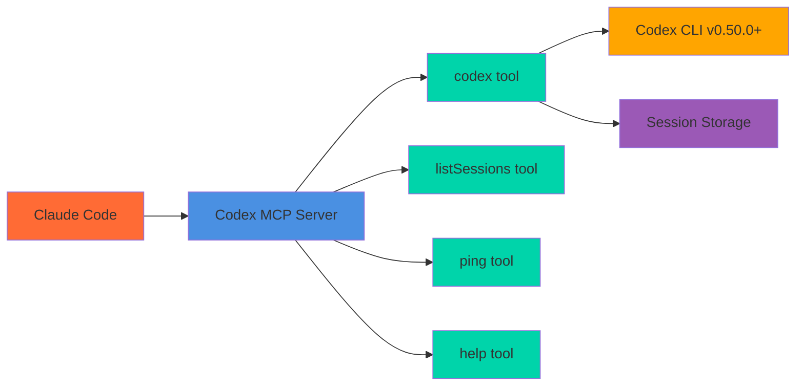

# Codex MCP Server

Advanced MCP server wrapper for OpenAI Codex CLI v0.50.0+ that provides enterprise-grade conversational AI coding assistance with session management, intelligent model selection, and native resume functionality.



## Prerequisites

- **OpenAI Codex CLI v0.50.0+** must be pre-installed and configured
  - Install: `npm i -g @openai/codex` or `brew install codex`
  - **Setup**: Run `codex login --api-key "your-openai-api-key"`
  - ⚠️ **Breaking Change**: `OPENAI_API_KEY` environment variable is no longer supported
  - ⚠️ **Version Requirement**: v0.50.0+ required (see [Version Compatibility](#version-compatibility) below)
- **Claude Code** installed

## Version Compatibility

This MCP server requires **codex CLI v0.50.0 or later** due to the following changes:

- **v0.50.0+**: Introduced `--skip-git-repo-check` flag (now required)
- **v0.50.0+**: Removed `--reasoning-effort` flag (no longer supported)

**If you have an older version of codex CLI**, you will need to upgrade:
```bash
npm update -g @openai/codex
```

For detailed version compatibility information, see [docs/codex-cli-integration.md](docs/codex-cli-integration.md).

## Installation

### One-Click Installation

#### VS Code
[](https://vscode.dev/redirect/mcp/install?name=codex-cli&config=%7B%22type%22%3A%22stdio%22%2C%22command%22%3A%22npx%22%2C%22args%22%3A%5B%22-y%22%2C%22codex-mcp-server%22%5D%7D)

#### VS Code Insiders
[](https://insiders.vscode.dev/redirect/mcp/install?name=codex-cli&config=%7B%22type%22%3A%22stdio%22%2C%22command%22%3A%22npx%22%2C%22args%22%3A%5B%22-y%22%2C%22codex-mcp-server%22%5D%7D)

#### Cursor
[](https://cursor.com/en/install-mcp?name=codex&config=eyJ0eXBlIjoic3RkaW8iLCJjb21tYW5kIjoibnB4IC15IGNvZGV4LW1jcC1zZXJ2ZXIiLCJlbnYiOnt9fQ%3D%3D)

### Manual Installation

#### Claude Code
```bash
claude mcp add codex-cli -- npx -y codex-mcp-server
```

#### Claude Desktop
Add to your Claude Desktop configuration file:

**macOS:** `~/Library/Application Support/Claude/claude_desktop_config.json`
**Windows:** `%APPDATA%/Claude/claude_desktop_config.json`

```json
{
  "mcpServers": {
    "codex-cli": {
      "command": "npx",
      "args": ["-y", "codex-mcp-server"]
    }
  }
}
```

## Usage in Claude Code

Once installed, Claude Code can use these tools:

### `codex` - AI Coding Assistant
Ask Codex to analyze code, generate solutions, or provide coding assistance with optional session support for conversational context.

**Basic Usage:**
```
Use the codex tool to explain this function:
[paste your code here]
```

**Advanced Usage:**
```
# Model selection (defaults to gpt-5-codex)
Use codex with model "gpt-4" to analyze this complex algorithm

# Reasoning effort control
Use codex with reasoningEffort "high" for thorough code review

# Session with model preferences (using advanced GPT-5 Codex by default)
Use codex with sessionId "my-session" and model "gpt-4" to refactor this code

# Continue conversation (uses native codex resume)
Use codex with sessionId "my-session" to make it more efficient

# Reset session context
Use codex with sessionId "my-session" and resetSession true to start fresh analysis
```

**Parameters:**
- `prompt` (required): Your coding question or request
- `sessionId` (optional): Session ID for conversational context
- `resetSession` (optional): Reset session history before processing
- `model` (optional): Specify model to use (defaults to 'gpt-5-codex'). Options: 'gpt-5-codex', 'gpt-4', 'gpt-3.5-turbo'
- `reasoningEffort` (optional): Control reasoning depth ('low', 'medium', 'high')

### `listSessions` - Session Management
List all active conversation sessions with metadata including creation time, last access, and turn count.

**Usage:**
```
Use listSessions to see all active coding sessions
```

### `ping` - Connection Test
Test if the MCP server is working properly.

### `help` - Codex CLI Help
Get information about Codex CLI capabilities and commands.

## Example Workflows

**Code Analysis:**
```
Please use the codex tool to review this TypeScript function and suggest improvements
```

**Conversational Code Development:**
```
# Start a session for complex refactoring
Use codex with sessionId "refactor-auth" to analyze this authentication system

# Continue building on the analysis
Use codex with sessionId "refactor-auth" to implement the security improvements you suggested

# Check session history
Use listSessions to see all active development sessions
```

**Bug Fixing:**
```
Use codex to help debug this error: [error message]
```

**Code Generation:**
```
Ask codex to create a React component that handles file uploads
```

## Advanced Features (Codex CLI v0.50.0+)

### Session Management
**Key Features:**
- **Native Resume**: Leverages `codex resume` for optimal conversation continuity
- **Intelligent Defaults**: GPT-5-Codex model for superior coding assistance
- **Fallback Context**: Manual context building when resume unavailable
- **Session Persistence**: Context maintained across interactions (24hr TTL)
- **Production-Ready**: Comprehensive error handling and graceful degradation
- **Enterprise-Scale**: 54 tests covering all functionality and edge cases

### Model Selection & Control
**Key Features:**
- **Default GPT-5 Codex**: Automatically uses the latest `gpt-5-codex` model for optimal coding assistance
- **Dynamic Models**: Choose between different models per request
- **Reasoning Effort**: Control AI processing depth (low/medium/high)
- **Per-Model Optimization**: Optimized prompts for different model families
- **Flexible Configuration**: Mix and match model and session parameters

### Enhanced Authentication
**Requirements:**
- ⚠️ **Breaking Change**: Environment variable `OPENAI_API_KEY` no longer supported
- **New Setup**: Run `codex login --api-key "your-key"` for authentication
- **Credential Storage**: Credentials stored securely in `CODEX_HOME/auth.json`

**Best Practices:**
- Use sessions with native resume for complex, multi-step development tasks
- **Default Model**: Uses `gpt-5-codex` by default for optimal coding assistance
- Choose appropriate reasoning effort: `low` for quick answers, `high` for complex analysis
- Select models based on task complexity: `gpt-5-codex` for coding (default), `gpt-4` for advanced reasoning, `gpt-3.5-turbo` for speed
- Reset sessions when switching to unrelated topics
- Check `listSessions` to manage active conversations

## Development

```bash
# Install dependencies
npm install

# Development mode
npm run dev

# Build
npm run build

# Start built server
npm start
```

## Documentation

### 📚 Comprehensive Guides
- **[Session Management](docs/session-management.md)** - Advanced session features and implementation details
- **[Codex CLI Integration](docs/codex-cli-integration.md)** - v0.50.0+ features, breaking changes, and migration guide
- **[API Reference](docs/api-reference.md)** - Complete tool documentation and usage examples

### 🔧 Development Resources
- **Testing Suite**: 54 comprehensive tests covering all functionality
- **TypeScript Support**: Full type definitions and IntelliSense
- **Error Handling**: Robust error recovery and graceful degradation
- **Performance**: Optimized for enterprise-scale usage

## License

ISC
