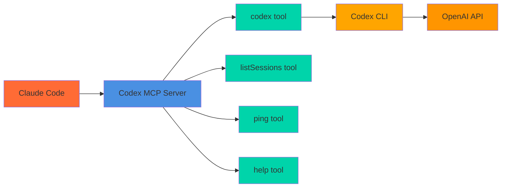

# Codex MCP Server

**MCP server wrapper for OpenAI Codex CLI that enables Claude Code to leverage Codex's AI capabilities directly.**

-   :rocket: **One‑click install**
    ---
    [VS Code](https://vscode.dev/redirect/mcp/install?name=codex-cli&config=%7B%22type%22%3A%22stdio%22%2C%22command%22%3A%22npx%22%2C%22args%22%3A%5B%22-y%22%2C%22%40comfucios%2Fcodex-mcp-server%22%5D%7D) ·
    [VS Code Insiders](https://insiders.vscode.dev/redirect/mcp/install?name=codex-cli&config=%7B%22type%22%3A%22stdio%22%2C%22command%22%3A%22npx%22%2C%22args%22%3A%5B%22-y%22%2C%22%40comfucios%2Fcodex-mcp-server%22%5D%7D) ·
    [Cursor](https://cursor.com/en/install-mcp?name=codex&config=eyJ0eXBlIjoic3RkaW8iLCJjb21tYW5kIjoibnB4IC15IEBjb21mdWNpb3MvY29kZXgtbWNwLXNlcnZlciIsImVudiI6e319)

-   :gear: **MCP tools**
    ---
    `codex`, `listSessions`, `ping`, `help`

-   :shield: **Requirements**
    ---
    - OpenAI Codex CLI (`npm i -g @openai/codex` or `brew install codex`)
    - `codex login` or `OPENAI_API_KEY` set
    - Claude Code or an MCP‑compatible client

